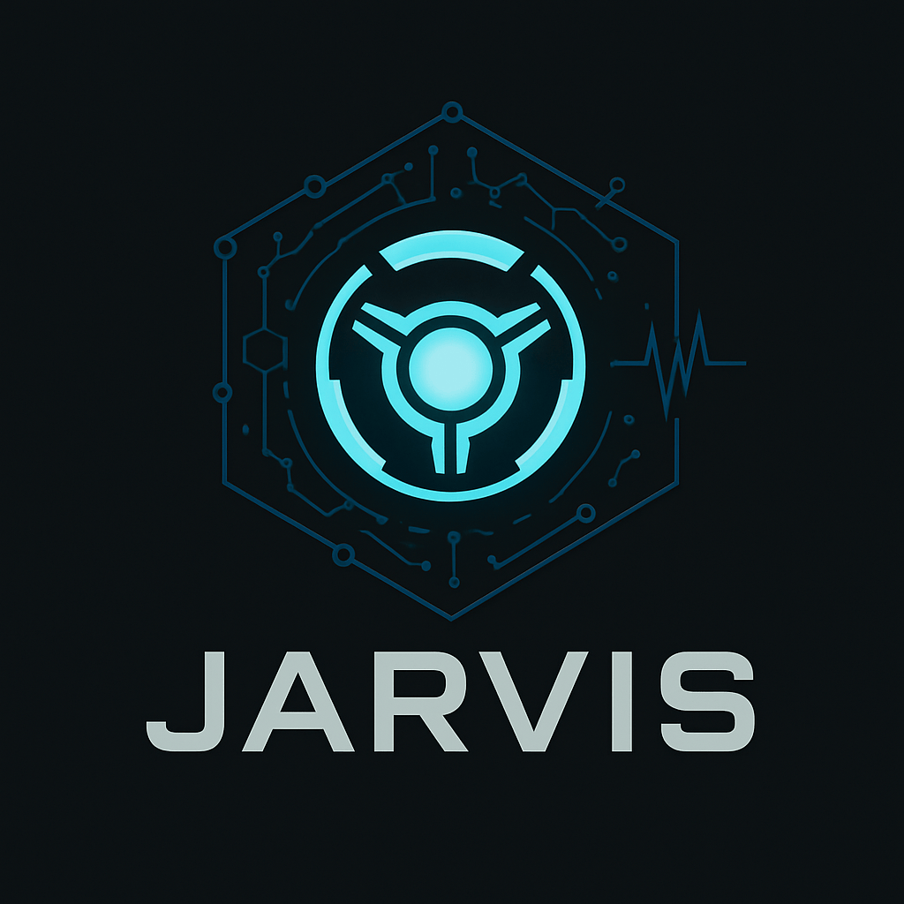

# Jarvis AI Assistant

<p align="center">
  
</p>

A voice-enabled advanced AI assistant inspired by the Marvel Cinematic Universe's J.A.R.V.I.S. (Just a Rather Very Intelligent System). This project combines local state-of-the-art large language models (LLMs), speech-to-text (ASR), text-to-speech (TTS), and external tool integration via the Model Context Protocol (MCP) to create a conversational AI experience.

## Features

*   **Voice & Text Interaction:** Communicate via microphone or text input.
*   **Wake Word Detection:** Activate the microphone by saying "Hey Jarvis" (requires browser support).
*   **Streaming Responses:** Receive text and audio responses incrementally.
*   **Multi-Language Support:** Configured for English (`en`) and German (`de`).
*   **Tool Integration (Qwen-Agent & MCP):**
    *   **MCP Servers:** Google Maps, Brave Search, Web Fetch, Weather (AccuWeather).
    *   **Custom Tools:** Includes a sample `magic_function`.
*   **Local LLM:** Powered by `llama-cpp-python` for local inference (configurable model).
*   **ASR:** Uses `Whisper` for accurate speech recognition.
*   **TTS:** Supports multiple engines (`Kokoro`, `Coqui XTTS-v2`, `FastTTS`).
*   **Location Awareness:** Uses browser geolocation to provide context-aware responses (e.g., for weather).
*   **Modern Web UI:** Built with HTML, CSS, and JavaScript.

## Architecture

*   **Frontend ([`frontend/`](frontend/)):**
    *   HTML ([`index.html`](frontend/index.html)), CSS ([`style.css`](frontend/style.css)), and JavaScript ([`script.js`](frontend/script.js)).
    *   Communicates with the backend via WebSockets.
    *   Handles user input (text/audio), displays conversation, plays back audio responses.
*   **Backend ([`backend/`](backend/)):**
    *   **API Server ([`app.py`](backend/app.py)):** Built with FastAPI, handles WebSocket connections, serves the frontend.
    *   **LLM Orchestration:** Uses `Qwen-Agent` to manage conversation flow and tool calls.
    *   **LLM Inference:** Proxies requests to a local `llama-cpp-python` server (or uses its own instance).
    *   **ASR:** Transcribes user audio using the configured Whisper model.
    *   **TTS:** Synthesizes AI responses into audio using the configured TTS engine.
    *   **Tooling:**
        *   Integrates with external tools via MCP servers ([`start_mcp_servers.sh`](backend/start_mcp_servers.sh)).
        *   Includes custom Python tools (e.g., [`MagicFunction`](backend/app.py)).

## Setup & Installation

1.  **Clone the Repository:**
    ```bash
    git clone <repository-url>
    cd jarvis
    ```

2.  **Backend Setup:**
    *   **Install Dependencies:** Navigate to the `backend` directory and install Python requirements. Note the specific build flags for `llama-cpp-python` if using GPU acceleration (like Metal on macOS).
        ```bash
        cd backend
        pip install -r requirements.txt
        # Ensure CMake and a C++ compiler are installed
        # For Metal GPU on macOS:
        # CMAKE_ARGS="-DLLAMA_METAL=ON" FORCE_CMAKE=1 pip install llama-cpp-python
        # Or install from requirements.txt which includes this line
        ```
    *   **Download LLM Model:** The required model (specified in [`backend/config.yaml`](backend/config.yaml)) will be downloaded automatically by `huggingface_hub` on first run if not present in the specified `local_dir`.
    *   **Configure API Keys:** Set the following environment variables for the MCP tools:
        *   `GOOGLE_MAPS_API_KEY`
        *   `BRAVE_API_KEY`
        *   `ACCUWEATHER_API_KEY`
        *(See [`backend/start_mcp_servers.sh`](backend/start_mcp_servers.sh) or [`.vscode/mcp.json`](.vscode/mcp.json) for details)*
    *   **Start MCP Servers:**
        ```bash
        ./start_mcp_servers.sh
        ```
        *(This will run the servers in the background and store their PIDs in `.mcp_pids`)*
    *   **Start Backend Server:**
        ```bash
        # Make sure llama-cpp-python server is running if you are proxying
        # python -m llama_cpp.server --model <path_to_your_gguf_model> --n_gpu_layers -1 ...

        # Start the main Jarvis backend
        uvicorn app:app --host 0.0.0.0 --port 8000 --reload
        ```
        *(Adjust host/port as needed. `--reload` is useful for development.)*

3.  **Frontend Access:**
    *   Open your web browser and navigate to `http://localhost:8000` (or the host/port you configured).

## Configuration

*   **Backend ([`backend/config.yaml`](backend/config.yaml)):** Configure LLM model details, ASR engine (Whisper settings), TTS engine (Kokoro, Coqui, FastTTS), logging level, and default location.
*   **VS Code MCP ([`.vscode/mcp.json`](.vscode/mcp.json)):** Defines MCP server configurations and required API key inputs for easy startup within VS Code using the Model Context Protocol extension.

## Usage

*   **Text Input:** Type your message in the input box and press Enter or click the send button.
*   **Voice Input:**
    *   Click the microphone button to start recording. Speak your query.
    *   Click the button again or wait for silence detection to stop recording.
    *   Alternatively, say "Hey Jarvis" (if wake word detection is active and supported by your browser) to start recording automatically.
*   **Language Selection:** Use the dropdown menu to select the input/output language (currently English or German).

## Docker

A [`Dockerfile`](backend/Dockerfile) and [`docker-compose.yml`](docker-compose.yml) are provided for containerizing the backend service.

*   **Build:**
    ```bash
    docker-compose build
    ```
*   **Run:**
    ```bash
    # Make sure to pass necessary API keys as environment variables
    # e.g., using a .env file or directly in the command line
    docker-compose up
    ```
*(Note: GPU acceleration within Docker requires specific configurations depending on your host OS and GPU drivers (e.g., NVIDIA Container Toolkit). The provided Dockerfile uses CPU by default unless `llama-cpp-python` is built with GPU flags.)*

## Scripts

*   [`backend/start_mcp_servers.sh`](backend/start_mcp_servers.sh): Starts the necessary MCP tool servers in the background.
*   [`backend/stop_mcp_servers.sh`](backend/stop_mcp_servers.sh): Stops the MCP servers started by the start script.

## License

Copyright (c) 2025 Tim Luka Horstmann

Permission is hereby granted, free of charge, to any person obtaining a copy
of this software and associated documentation files (the "Software"), to use,
copy, modify, merge, publish, and distribute the Software, subject to the following conditions:

1.  The above copyright notice and this permission notice shall be included in all copies or substantial portions of the Software.

2.  The Software may only be used for **non-commercial purposes**. Commercial use, including but not limited to selling, sublicensing, hosting as a paid service, or using in commercial products, is strictly prohibited **without prior written permission** from the copyright holder.

3.  THE SOFTWARE IS PROVIDED "AS IS", WITHOUT WARRANTY OF ANY KIND, EXPRESS OR IMPLIED, INCLUDING BUT NOT LIMITED TO THE WARRANTIES OF MERCHANTABILITY, FITNESS FOR A PARTICULAR PURPOSE AND NONINFRINGEMENT. IN NO EVENT SHALL THE AUTHORS OR COPYRIGHT HOLDERS BE LIABLE FOR ANY CLAIM, DAMAGES OR OTHER LIABILITY, WHETHER IN AN ACTION OF CONTRACT, TORT OR OTHERWISE, ARISING FROM, OUT OF OR IN CONNECTION WITH THE SOFTWARE OR THE USE OR OTHER DEALINGS IN THE SOFTWARE.
